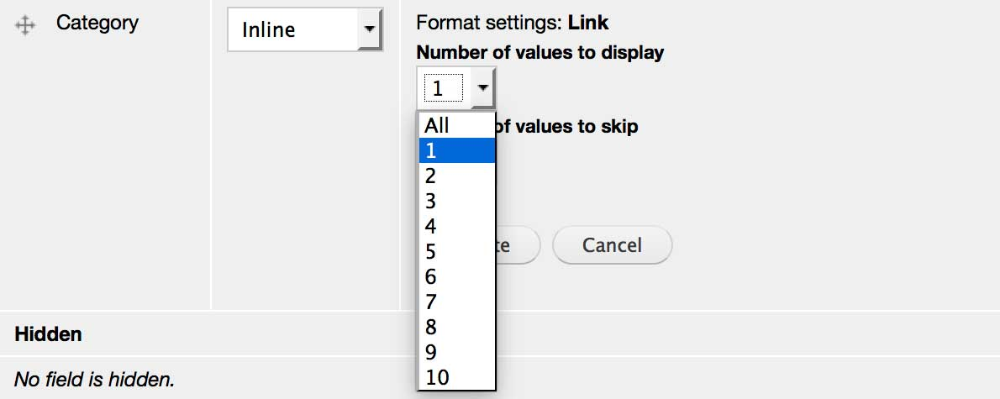

#Field Multiple Limit

This is a simple module that provides settings to limit the number of values to 
display on fields with multiple values. (For example, in an image field
with multiple images, you may only wish to display one in the teaser view).

The module extends the field display settings for fields which permit multiple 
values. Site administrators can specify how many values to display for each 
display mode (e.g. teaser). Optionally, an off-set can be specified to skip 
some values. 

##Installation

- Install this module using the official Backdrop CMS instructions at
  https://backdropcms.org/guide/modules
- This module depends on the [Field Formatter Settings module](https://github.com/backdrop-contrib/field_formatter_settings), 
  so install that first.

##Issues

Bugs and Feature requests should be reported in the Issue Queue:
https://github.com/backdrop-contrib/field_multiple_limit/issues

##Current Maintainers

- Laryn Kragt Bakker - CEDC.org (https://github.com/laryn/)

##Credits

- Ported to Backdrop CMS by Laryn Kragt Bakker - CEDC.org (https://github.com/laryn/).
- Maintained for Drupal by Andrew Macpherson (https://github.com/fuzzbomb).

##License

This project is GPL v2 software. See the [LICENSE.txt](LICENSE.txt) file in this directory for
complete text.
